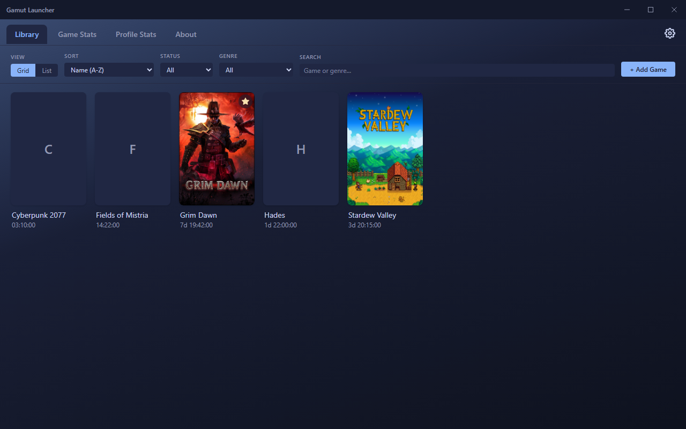
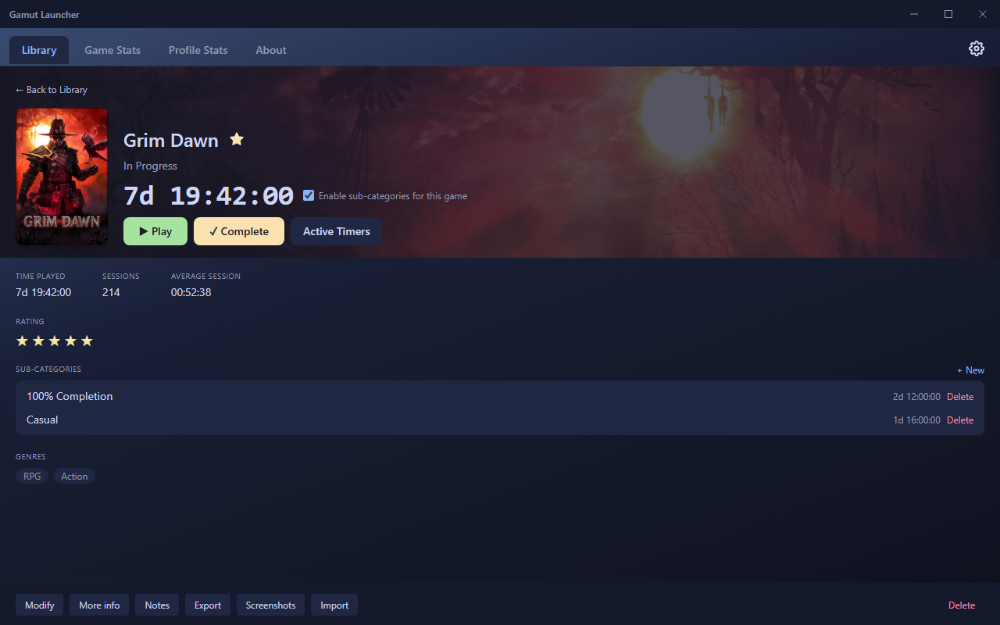
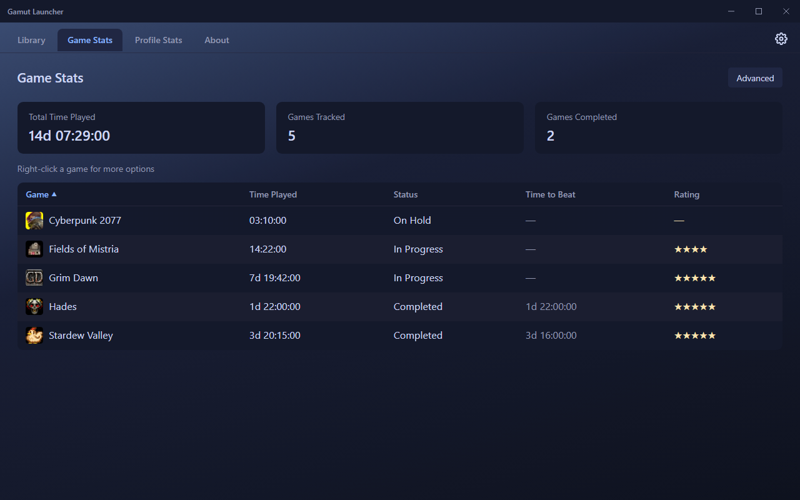

# 🎮 Gamut

A manual play/pause time tracker for your games — track time spent playing each one, jot notes, rate and tag genres, mark completions, and watch your stats grow.

## Download

**[⬇ Download the latest installer from Releases](../../releases/latest)**

Run the installer, click through, done — no admin rights needed. Installs to your user folder and adds a Start Menu / optional Desktop shortcut. The app checks for updates on launch and can update itself in place.

## Screenshots

|                                     Library                                     |                                    Game page                                    |                                    Game Stats                                   |
| :-------------------------------------------------------------------------------: | :-------------------------------------------------------------------------------: | :-------------------------------------------------------------------------------: |
|  |  |  |

## Features

- Manual play/pause game timer per profile, with autosave every few seconds and concurrent timers (switching games doesn't pause the one you left)
- A personal games list: add games, sort by name/last played/rating/genre, filter by genre
- Four-state tracking — Playing, Completed, Dropped, On Hold — each with its own snapshot of time and date
- Genre tags (multi-select), star ratings, notes, and manual Add/Remove Time for time tracked elsewhere
- Optional sub-categories per game (e.g. a 100% run vs. a casual replay) — pick one when you press Play, break down a game's total by category, credit or remove time from specific categories
- Duplicate, export (`.gtprofile`), and import individual game profiles
- Custom box-art icon and background image per game
- Five color themes (Midnight Blue, Paper White, Slate Grey, Rose, Retro Terminal) plus full custom colors and font choice
- 10 languages, switchable anytime, no restart needed
- Optional system tray icon (a green play badge appears while anything's tracking, plain otherwise), launch-at-startup, daily rolling backups of your tracked time
- Everything is stored locally — no account, no internet required except to check for app updates

## Branches

- **`main`** — Gamut itself, the Electron edition. This is what the releases and the in-app updater ship from.
- **`dev`** — work in progress on the next version. Unstable by design; nothing here is released until it lands on `main`.
- **`v1`** — the original lightweight Python/Tkinter edition (v1.9.1), frozen but still available for anyone who'd rather not have the Electron/Chromium footprint.

## Building from source

```bash
npm install
npm run dev       # run in development
npm run typecheck
npm run package    # build a Windows installer into release/
```

## License

GPL-3.0-or-later — see [LICENSE](LICENSE).
